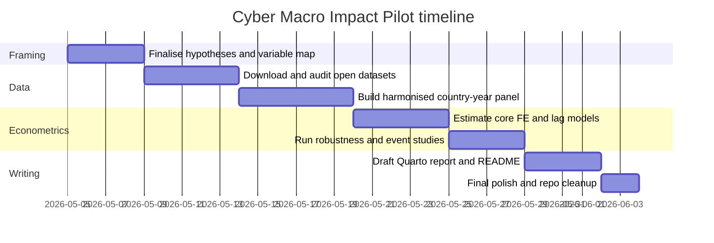

# Cyber Macro Impact Pilot Research Review and Plan

## Executive summary

The strongest existing evidence does **not** yet give a clean global causal estimate of “cybersecurity spending raises GDP by x%”. Instead, the literature is much stronger on three adjacent questions: the output and welfare costs of cyber incidents, the firm- and supply-chain channels through which those costs propagate, and the policy reasons why private agents may underinvest in cybersecurity relative to the social optimum. The best official reviews from the entity["organization","World Bank","development bank"], the entity["organization","International Monetary Fund","multilateral lender"], and the entity["organization","Organisation for Economic Co-operation and Development","intergovernmental policy forum"] all converge on the same diagnosis: cyber risk has real economic consequences, but measurement is fragmented, under-reporting is material, and internationally comparable country-year cyber investment data remain thin. citeturn18view0turn25view0turn30view0turn28view0

For a flagship report focused on the **macroeconomic impact of cyber investments**, the most defensible empirical move is therefore a **hybrid design** rather than a single heroic regression. In practice, that means combining: an open-data country panel of cyber readiness and incident intensity; a macro outcomes panel from WDI and productivity databases; and, where licensed data are available, a sensitivity layer using commercial cybersecurity spend benchmarks. The pilot should treat direct spend measures as ideal but scarce, and treat readiness, governance, workforce, insurance, and incident measures as structured proxies rather than substitutes. citeturn31view5turn31view6turn31view2turn32view0turn31view9turn31view12turn5search1

The highest-confidence cross-country evidence currently available is a 2024 World Bank working paper showing that, in non-high-income countries, a 1% increase in disclosed cyber incidents is associated with a **0.0138% decrease in GDP per capita**, and that one additional incident is linked in dynamic specifications to roughly **USD 2.4–2.7 lower GDP per capita**. The same paper also finds that more cyber-vulnerable industries grow faster in countries with stronger cybersecurity commitments, providing first-pass evidence that national cyber capacity matters for real sector performance. citeturn15view2turn16view0

Firm- and network-level studies make the macro mechanisms more plausible. The NotPetya supply-chain study finds **USD 7.3 billion** of downstream customer profit losses, around **four times** the losses of directly hit firms, while large-firm breach studies find statistically significant declines in market value, sales growth, and increases in leverage after successful attacks. Text-based cyber-risk work further shows spillovers from firms to sectors and estimates annual global cyber-risk exposure in the **hundreds of billions to low trillions of dollars**, depending on construction. These studies do not by themselves identify the return to cyber investment, but they do identify the channels through which cyber investment could affect GDP, productivity, capital formation, and employment resilience. citeturn21view0turn43view0turn43view3turn23view0

My working assumption, because you specified **no country or time constraint**, is a **global unbalanced panel** with the longest span compatible with the chosen cyber variables. For an open-data MVP, the most practical window is likely **2014–2024** for incidents plus macro outcomes, with readiness indicators layered in as annual, low-frequency, or structural covariates depending on the source. If you have access to licensed country or regional spend series from commercial providers, add them as a secondary, publication-quality robustness exercise rather than as the sole core dataset. citeturn47search0turn35search6turn32view0turn31view2

## Literature synthesis

The literature is best read as a ladder. At the bottom rung are **microeconomic and market-value studies** showing that cyber incidents affect firms’ valuation, sales growth, financing, and reputation. In the middle are **network and sector studies** showing spillovers through supply chains and sector-level risk pricing. At the top are **country and macrofinancial studies** showing that cyber incidents and weak cyber capacity are associated with lower income, systemic financial vulnerabilities, and lower resilience. What is still missing is a large, well-identified literature directly linking **country-year cybersecurity investment** to **country-year macro outcomes**. citeturn18view0turn25view0turn23view0turn15view2

| Source | Design | Main finding | Why it matters for your repo | Key source |
|---|---|---|---|---|
| *The Role of Cybersecurity in Economic Performance* | Country panel, country and year fixed effects; Arellano-Bond; cross-country cross-industry IV | In non-high-income countries, a 1% increase in incidents is associated with a 0.0138% fall in GDP per capita; globally, 0.0125%. Dynamic estimates imply one more incident is linked to roughly USD 2.4–2.7 lower GDP per capita in non-high-income countries. Cross-industry IV estimates show stronger cybersecurity commitments raise growth in more cyber-vulnerable industries. | This is the clearest currently available cross-country bridge from cyber incidents/capacity to macro outcomes. It is the closest template for your pilot FE design. | citeturn15view2turn16view0 |
| *A Review of the Economic Costs of Cyber Incidents* | Literature review synthesising 50+ academic papers and major industry reports | Reviews direct and indirect costs, stresses that aggregate global loss figures are methodologically inconsistent, and notes that **over 90%** of reviewed literature focuses on developed countries, mainly the United States. | Best official synthesis for motivating why a flagship report should focus on data architecture, not just coefficients. | citeturn18view0turn19view4 |
| NotPetya supply-chain study | Difference-in-differences around a quasi-exogenous cyber shock | A conservative estimate implies **USD 7.3 billion** in customer profit losses, around **four times** the losses reported by directly hit firms. Customers used liquidity buffers and credit lines, which helped them maintain investment and employment. | Strongest evidence for macro transmission through supply chains, profits, and financing, even when direct employment/investment effects are muted. | citeturn21view0turn22view1 |
| Successful cyberattacks on target firms | Event study plus matched firm panel | Attacks involving financial information loss generate about **−1.09%** abnormal returns; large firms see post-attack sales growth fall by about **3.4 percentage points**; retail firms by **5.4 percentage points**; leverage rises by about **2.4 percentage points** after attack. | Gives concrete channels from cyber shocks to sales, balance sheets, and investment capacity. | citeturn43view0turn43view3turn42view0 |
| Under-reporting of cyberattacks | Disclosure study using disclosed vs withheld attacks | Withheld attacks are associated with about a **2.6%** decrease in equity values versus **0.7%** for disclosed attacks. | Crucial warning: incident datasets are endogenous to disclosure, so your macro panel must treat observed incidents as noisy lower bounds. | citeturn19view4 |
| *The Anatomy of Cyber Risk* | Global firm-level text-based cyber-risk measure from earnings calls; asset pricing and balance-sheet analysis | Cyber risk lowers returns and profitability, spills over from firms to sectors, and a back-of-the-envelope calculation suggests a global annual cyber-risk cost of about **USD 1.14 trillion**; a one standard deviation increase in exposure raises option-implied risk measures by roughly **3–5% of a standard deviation**. | Strong evidence that cyber risk is not just an IT issue; it is priced, systemic, and economically large enough to matter at aggregate level. | citeturn23view0 |
| Reputation effects of breaches | Firm-level reputational/intangible capital study | Average breaches can increase reputational capital for some firms, but the **largest and most salient** breaches are associated with **5–9%** losses in reputational intangible capital. | Important nuance: not every breach has the same economic sign; severity and salience matter. | citeturn41search3 |
| *Cyber Risk, Market Failures, and Financial Stability* | Policy/economic analysis | Argues cyber risk features information asymmetries, externalities, coordination failures, and risk concentration, leading to underinvestment relative to the social optimum. | This is the cleanest policy rationale for why public cyber investment and regulation can have macro payoffs beyond private returns. | citeturn25view0turn26view1 |
| *The Rise of Cyber Events and Digital Fraud in the Financial Sector* | Descriptive multicountry financial-sector analysis | Across 20 sectors in 162 countries, cyber events in finance accounted for about **10%** over the past decade; cyber-enabled fraud nearly tripled; scam losses are a larger share of GDP in developing economies. | Useful for the financial-stability chapter and for motivating a finance-sector subsample or case study. | citeturn27view0 |

Two synthesis points matter most for your research design. First, the evidence on **incident harm** is materially stronger than the evidence on **investment returns**. Second, the best investment-related evidence is mostly indirect: countries with stronger cyber commitments appear more resilient, and firms/sectors invest or rebalance after attacks, but very few papers observe cyber spending itself at country-year frequency. citeturn16view0turn25view0turn18view0

The central research gap is therefore not “does cyber matter economically?”; that question is already answered. The gap is “**which investments**, in **which institutional settings**, yield measurable gains in output, productivity, investment, and employment resilience?” The official literature also warns that measurement problems are structural: under-reporting, inconsistent taxonomies, sparse time series, and the absence of a trusted public-private incident repository or broadly available spend database. citeturn30view0turn28view0turn19view4

## Data inventory

On the data side, open official sources from the entity["organization","International Telecommunication Union","un telecom agency"], the entity["organization","European Union Agency for Cybersecurity","eu cybersecurity agency"], and the entity["organization","United Nations Conference on Trade and Development","un trade body"] are enough for a credible open-data pilot, while licensed benchmarks from entity["company","Gartner","research firm"] and entity["company","IDC","market intelligence firm"] and case-severity benchmarks from entity["company","IBM","technology company"] should be treated as sensitivity layers rather than the backbone of the workflow. citeturn31view6turn31view9turn31view8turn31view12turn5search1turn31view11

### Core datasets for an open, reproducible panel

| Dataset | Access | Suggested variables | Coverage | Best use in pilot | Main limitations |
|---|---|---|---|---|---|
| WDI and World Bank Indicators API | World Bank Data / API docs citeturn31view5turn8search7 | `NY.GDP.MKTP.KD.ZG` GDP growth, `SL.GDP.PCAP.EM.KD` GDP per person employed, `NE.GDI.TOTL.ZS` gross capital formation % GDP, `SL.EMP.TOTL.SP.ZS` employment-to-population, `IT.NET.USER.ZS` internet users, plus inflation, trade, population, education controls | Broad global annual coverage, many series back 50+ years; employment series to 2025 on current metadata pages | Core outcome and control block | No direct cyber measures; TFP is weakly covered in WDI itself. citeturn8search0turn8search1turn45search0turn45search13turn10search14 |
| Digital Adoption Index | DAI page / associated World Bank data files citeturn31view0turn10search17 | Overall DAI, business, people, government sub-indices | 180 countries; effectively 2014 and 2016 | Good **baseline level** of digital exposure/absorptive capacity | Only two waves; not suitable as the main annual panel regressor. citeturn31view0turn10search17 |
| GovTech Maturity Index | GTMI programme page and World Bank Data Catalog citeturn31view1turn32view0 | Overall GTMI plus four pillars: core systems, service delivery, citizen engagement, enablers | 2020, 2022, 2025; 197–198 economies | Excellent government cyber/digital governance proxy; useful low-frequency structural measure | Sparse waves; partly self-reported; not an annual spend series. citeturn31view1turn32view0 |
| ICT Development Index | ITU IDI page/dashboard citeturn31view2 | Overall IDI | Published since 2009, but methodology changed in 2023 after a six-year hiatus; 2023, 2024, 2025 editions under the new method | Good control for broader digital capability and inclusion | Clear methodology break; should not be pooled naïvely across old and new vintages. citeturn31view2 |
| Global Cybersecurity Index and ITU DataHub cyber indicators | ITU GCI and ITU DataHub citeturn31view3turn31view6turn35search6 | Overall GCI, pillar scores, wider cyber trust/governance indicators where available | DataHub indicates cybersecurity coverage for 194 economies and 2020–2024 for GCI-related series; ITU DataHub covers nearly 200 economies | Best open, internationally comparable country-level cyber-readiness measure | Commitment/readiness is not spending; some variables reflect policy presence rather than operational quality. citeturn35search6turn31view3 |
| World Bank annex on disclosed incidents | World Bank annex page and report | Country-year counts of disclosed cyber incidents, 2014–2022 | Country counts from 2014–2022 | Quick way to build a country-year incident intensity panel | Media-disclosed incidents only; no direct loss values; disclosure bias. citeturn11search0turn11search1 |
| Cyber Events Database from the entity["organization","University of Maryland","public university"] | CISSM web app / downloads | Event-level data: target country, source country, industry, motive, threat actor, end effect, dates | 2014 to present; current public description says updated monthly and available through March 2026 | Best open event-level dataset for building country-year counts by type, sector, and motive | Open-source media coding; coverage varies by language and reporting ecology. citeturn47search0turn47search2 |
| EuRepoC Global Dataset of Cyber Incidents | EuRepoC / Zenodo static releases | 60 coded variables on incidents; dates, actors, sectors, legal/political coding | 2000–2024 in public v1.3 static release; continuously updated live database | Excellent transparent alternative / robustness source, especially for geopolitical and state-linked activity | Focus is cyber incident coding rather than direct economic losses; evolving database can change over time. citeturn47search3turn47search5turn47search13 |
| OECD and Eurostat enterprise cyber indicators | OECD paper and OECD ICT Access/Use databases | Share of businesses experiencing ICT incidents (E3), enterprises with formal ICT privacy-risk policies (E7), enterprise ICT security measures | Mainly OECD/EU economies; availability is limited across years, especially 2018 and 2021 for some security items | Strong OECD validation subsample for firm-security behaviour | Sparse panel; mostly extensive-margin measures, not spend or loss severity. citeturn29view2turn28view0 |
| ENISA CIRAS and telecom incident reporting | ENISA CIRAS and annual telecom reports | Major telecom incident counts, root causes, user hours lost, incident types | EU annual summaries; 2012–2024 multiannual series with 1,930 incidents and 188 incidents in 2024 | Excellent sector-specific stress-testing dataset; useful EU subsample or case-study appendix | EU only; covers major incidents above reporting thresholds; thresholds change over time. citeturn31view9turn36view0 |
| UNCTAD digital economy measures | UNCTAD measurement pages and downloadable files | B2C e-commerce index, ICT-enabled services exports, digital trade controls | Cross-country, varying years; downloadable files available from official pages | Good digital-economy control and heterogeneity variable | Not cyber-specific; best used as exposure or complementarity controls. citeturn31view8turn9search10 |
| Productivity databases | Penn World Table and World Bank / other global productivity databases | TFP growth, labour productivity growth, capital stock, employment | PWT 11 covers 185 countries, 1950–2023; World Bank productivity database includes labour productivity and TFP growth variables | Preferred source for TFP and productivity outcomes missing from WDI | Requires harmonisation to ISO3 and year conventions; TFP construction differs by source. citeturn45search3turn45search10turn45search18 |

### Supplementary and partly proprietary sources

| Source | What it gives you | Coverage | Use in pilot | Main caveat |
|---|---|---|---|---|
| entity["organization","National Association of Insurance Commissioners","us insurance regulator forum"] cyber insurance reports | U.S. cyber insurance premiums, policies, underwriting and losses | Primarily U.S.; annual reports | Proxy for insured cyber risk intensity and market maturity | U.S.-centric; not a global spend series. citeturn31view10turn6search4 |
| OECD cyber insurance work and Verisk PCS | Cyber-insurance market development, insured loss framing, event catalogues | OECD policy coverage; PCS global event data is specialised | Good appendix material for insured-loss channels | PCS is specialist and not a simple open macro panel. citeturn6search2turn6search3turn6search0 |
| Gartner global information security spending | Commercial top-down security spending totals | Global and regional; some country views depending licence | Best directional benchmark for scaling spend narratives | Mostly paywalled; limited reproducibility for a public repo. citeturn31view12turn5search9 |
| IDC Worldwide Security Spending Guide | Geography, industry and company-size spending views | Global and regional, richer than press releases if licensed | Best commercial cross-check on spend levels | Also paywalled; public access is partial. citeturn5search1turn5search9 |
| IBM Cost of a Data Breach | Average breach cost, incident lifecycle, governance modifiers | International survey-based annual reports | Useful severity benchmark and narrative figure | Firm survey, not country panel; should not be used as national loss estimate. citeturn31view11 |
| Verizon DBIR and similar private incident reports | Incident typologies and case counts | Annual, global contributors but not a country-year macro panel | Useful typology and discussion of threat composition | Geography and reporting are not designed for macro regression. citeturn7search11turn7search3 |

**Recommended proxy hierarchy when direct cyber spend is missing**

The cleanest direct proxy is **licensed cybersecurity spending scaled by GDP** from Gartner/IDC, but for a public, reproducible repository the best operational alternative is a layered proxy strategy: use **GCI/ITU cyber-readiness indicators** for structural capacity, **incident counts/loss proxies** for realised threat intensity, **OECD/Eurostat business-security measures** for adoption, and **cyber insurance premiums or claims** where available for financial exposure. Treat DAI and IDI as broader digital contextual variables, not cyber-spend measures. citeturn31view12turn5search1turn35search6turn29view2turn31view10turn31view0turn31view2

A good practical rule is: **readiness measures proxy preventive investment and capability; incident measures proxy realised risk; insurance measures proxy priced exposure; commercial spend measures proxy explicit expenditure**. Your report will be stronger if it states this taxonomy explicitly rather than pretending that one index measures all four. citeturn25view0turn30view0

## Empirical strategy

The pilot should be built around three linked empirical designs rather than one regression. The baseline design should ask whether countries with higher cyber capability or investment proxies experience better macro outcomes **within country over time**, net of common shocks. A second design should ask whether incident intensity is associated with weaker macro performance. A third design should estimate **event-time effects** around major cyber shocks or major cyber-policy upgrades. This approach is closest to the best current country-level evidence while staying feasible inside a concise public repo. citeturn15view2turn16view0turn21view0

The recommended baseline specification is:

\[
y_{it}=\beta C_{i,t-k}+\gamma'X_{i,t-k}+\alpha_i+\lambda_t+\varepsilon_{it}
\]

where \(y_{it}\) is one of: GDP growth, log GDP per capita, labour-productivity growth, TFP growth, gross capital formation as a share of GDP, or employment-to-population; \(C_{i,t-k}\) is a cyber investment/capacity variable or proxy lagged by one to three years; \(X_{i,t-k}\) includes macro and digital controls; \(\alpha_i\) are country fixed effects and \(\lambda_t\) year fixed effects. For incident models, replace \(C\) with log incident counts, incident rate per million people, or insured or reported loss intensity when available. The World Bank macro paper used country and time fixed effects with lagged digital controls, and that is the right benchmark for your MVP. citeturn15view2turn16view0

A practical specification menu is below.

| Design | Dependent variables | Key regressor | Best sample | What it tells you |
|---|---|---|---|---|
| Open-data FE panel | GDP growth, log GDP pc, labour productivity growth, TFP growth, GCF/GDP, employment ratio | GCI overall/pillars, GTMI, OECD security adoption measures, cyber-readiness factor | Global or OECD/EU subsample depending regressor | Whether stronger cyber capacity is associated with better macro outcomes |
| Incident FE panel | Same as above | Log disclosed incidents, incidents per million, sector-weighted incident counts | Global 2014–2022 or 2014–2024 depending source | Whether realised cyber harm is associated with weaker macro performance |
| Policy/event study | GDP growth, investment ratio, productivity growth | Major attack year or major policy upgrade indicator | Countries with clear event dates | Dynamic paths before and after shocks or reforms |
| Distributed-lag model | Same as above | 1–3 year lags of cyber variable | Global | Whether effects are delayed, which is likely for prevention investments |
| Sector-exposure interaction | Manufacturing, services or finance value added / growth | Country cyber capacity × pre-period digital/cyber exposure | Subsample with sector data | Whether cyber commitments matter more where exposure is higher |

**Preferred independent variables**

Use three families of cyber regressors. First, a **capacity family**: GCI overall and pillars, GTMI, possibly a standardised cyber-readiness factor. Second, a **realised-risk family**: disclosed incident counts, incident rates, and sector-specific incident counts where event-level data allow. Third, a **financial-exposure family**: cyber insurance penetration, insured losses, or commercial spend/GDP when licensed data exist. For identification and interpretability, do not collapse these into one opaque composite in the main specification; keep them separate in the headline tables and use a composite only in robustness checks. citeturn35search6turn32view0turn47search0turn31view10

**Controls**

A parsimonious but credible control set is: internet use, mobile subscriptions, population, inflation, trade openness, broad governance quality, education/human capital, and possibly financial depth. For productivity models, add investment rate and employment controls. For investment models, do **not** automatically include variables that sit on the causal path from cyber investment to growth, such as all digital adoption measures, in every specification; instead, present both a “reduced-form” version and a “conditioning” version. This distinction will make the report more economically coherent. citeturn15view2turn31view5

**Lags**

Use one-, two-, and three-year lags of cyber variables as the default. Incident costs can show up quickly in valuation and sales, but macro prevention gains are more likely to arrive with delay through fewer disruptions, more trust, improved investment conditions, and slower-moving productivity channels. Distributed lags are more informative than a single contemporaneous coefficient. citeturn43view3turn21view0turn30view0

**Identification threats**

The big threats are not subtle. Richer countries both spend more on cyber and report incidents more fully; stronger institutions both adopt cyber policies and grow faster; media-based datasets measure disclosure as much as they measure harm; and some indices are low-frequency or have methodology breaks. Reverse causality and measurement error are therefore first-order issues, not footnotes. That is why your README should avoid causal language unless it is tied to an event study or a genuinely quasi-exogenous design. citeturn19view4turn18view0turn31view2turn32view0

**IVs and quasi-experimental options**

For the pilot, I would treat instrumental variables as **secondary**. If you insist on an IV layer, the most defensible candidates are interacted designs such as: pre-period digital exposure × global cyber shock waves; or pre-period sectoral exposure × national cyber-policy upgrades proxied by changes in legal or organisational cyber pillars. Both require a strong exclusion argument and should be presented as robustness, not the headline result. A cleaner route for the repo is an event-study appendix around major attacks or policy reforms. citeturn21view0turn35search6

**Robustness checks**

Run at least six. Use alternative cyber measures; balanced and unbalanced panels; log and rate versions of incident counts; exclusions for conflict years and very small states; clustered standard errors at country level plus a cross-sectional-dependence robust variant; and placebo leads in event studies. Also split the sample by income group, because the current official literature suggests cyber incidents may matter more in developing economies and that scam losses are relatively larger versus GDP there. citeturn15view2turn27view0

**Power and sample-size considerations**

The pilot is well powered only if you use a reasonably annual cyber series. A panel built from incidents plus WDI outcomes over roughly 2014–2022 or 2014–2024 can plausibly reach 1,000–1,500+ country-years. By contrast, DAI and GTMI alone are too sparse for a serious annual FE design and should be used as structural or low-frequency regressors. If the final analytic sample drops below roughly 600 country-years after merging and lagging, standardise outcomes, keep the model sparse, and prioritise confidence intervals and sign stability over small coefficient precision. citeturn47search0turn32view0turn31view0turn31view2

## Workflow and code plan

The repository should aim for a **public, reproducible MVP** that a reviewer can clone and run without private licences, with commercial spend data added only through an optional local file path. The ideal output is a single `analysis.qmd` or `report.qmd` under roughly 200 lines of substantive analysis code, supported by small helper scripts for download, cleaning, and merging. The code should privilege transparency over engineering flourish.

```text
cyber-macro-impact-pilot/
├─ README.md
├─ _quarto.yml
├─ report.qmd
├─ renv.lock
├─ data_raw/
│  ├─ wdi/
│  ├─ wb_digital/
│  ├─ itu/
│  ├─ incidents/
│  └─ private_optional/
├─ data_processed/
│  ├─ panel_country_year.parquet
│  └─ data_dictionary.csv
├─ R/
│  ├─ 00_packages.R
│  ├─ 01_download_open_data.R
│  ├─ 02_clean_harmonise.R
│  ├─ 03_build_panel.R
│  ├─ 04_model_specs.R
│  └─ 05_figures.R
└─ output/
   ├─ tables/
   └─ figures/
```

A sensible package stack in **R** is: `wbstats`, `httr2`, `jsonlite`, `readxl`, `arrow`, `janitor`, `countrycode`, `dplyr`, `tidyr`, `stringr`, `fixest`, `modelsummary`, `broom`, `ggplot2`, `patchwork`, `targets`, and `renv`. `fixest` is the right workhorse for two-way FE models; `targets` keeps the pipeline reproducible; `renv` makes the repo portable in VS Code.

The minimal reproducible workflow is straightforward. Download WDI and other open datasets. Standardise country codes to ISO3. Build a long country-year panel. Create a metadata dictionary that records source, units, year coverage, and transform for every variable. Estimate a small pre-registered set of models. Export one tidy results table and two charts. Render a single Quarto report that narrates assumptions, limitations, and findings in plain English. Where a source is sparse or licensed, the report should clearly mark it as optional.

The two chart ideas that best fit the brief are below.

| Chart | Type | Variables | Why it is persuasive |
|---|---|---|---|
| Cyber readiness and productivity | Residual binscatter or partial-correlation scatter | y: labour productivity growth or TFP growth residualised on country and year FE; x: lagged GCI or cyber-readiness factor residualised likewise | Shows the main research question visually without pretending raw correlations are causal |
| Macro response to cyber shocks | Event-study coefficient plot | y: coefficients for years −3 to +3 around a major cyber incident shock; outcome: GDP growth or GCF/GDP | Communicates dynamic timing and pre-trend discipline better than a single coefficient |




| Deliverable | Target | Notes |
|---|---|---|
| `report.qmd` | ~200 lines of substantive analysis | One main document that can be rendered end-to-end |
| `README.md` | 1–2 tight pages | Question, data, methods, replication steps, key caveats |
| `panel_country_year.parquet` | One merged analysis file | Avoid multiple ad hoc merges in the report |
| `data_dictionary.csv` | One row per variable | Essential for credibility with reviewers |
| Two figures | One structural, one dynamic | Use publication-ready labels and source notes |
| Results table | One headline regression table + one robustness table | Keep the story narrow and defensible |

## Ready-to-use prompts for Claude and GPT-5.5

Below are prompts designed to automate the three most valuable stages: literature extraction, data wrangling, and code generation. Replace items in `ALL_CAPS` before use.

### Literature extraction prompt

**Input expectation:** a folder or list of PDFs/URLs for official reports and papers.  
**Output expectation:** a structured evidence matrix in CSV or markdown with columns for source, design, sample, dependent variable, key independent variable, exact effect size, identification note, and limitation.

**Claude**

```text
You are helping build a repository called cyber-macro-impact-pilot.

Task:
Read the attached papers and official reports on cybersecurity, cyber incidents, cyber investments, and macroeconomic outcomes.
Extract ONLY information that is explicitly supported by the source.

Return a markdown table with these columns:
1. source_title
2. year
3. source_type
4. geography
5. sample_period
6. unit_of_analysis
7. dependent_variable
8. cyber_variable
9. methodology
10. exact_effect_size
11. interpretation_in_plain_english
12. causal_or_associational
13. major_limitation
14. direct_relevance_to_repo

Rules:
- Prioritise peer-reviewed papers, World Bank, IMF, OECD, ITU, ENISA, and major working papers.
- Quote exact coefficients or effect sizes when available.
- If a paper is conceptual only, say “no estimated effect size”.
- If the study is firm-level, explicitly state the macro channel it informs.
- Do not invent missing values.
- End with a 10-line synthesis: strongest evidence, weakest evidence, main gaps.

Materials:
PASTE_OR_ATTACH_SOURCES_HERE
```

**GPT-5.5**

```text
You are compiling a citation-grade evidence base for a repo named cyber-macro-impact-pilot.

Read the attached sources and produce:
A. a structured evidence matrix
B. a short synthesis memo

Evidence matrix schema:
- source_title
- publication_year
- publisher_or_journal
- official_or_academic
- country_coverage
- years_covered
- level_of_analysis
- econometric_design
- outcome_variables
- cyber_measure
- exact_coefficients_or_effect_sizes
- significance_if_reported
- identification_comment
- data_limitations
- why_it_matters_for_macro_report

Instructions:
- Extract exact numbers wherever present.
- Separate direct evidence on cyber investment/spending from indirect evidence on incidents/losses.
- Tag each source as one of: direct_spend, readiness_proxy, incident_loss, insurance, conceptual_policy.
- Use “not reported” rather than guessing.
- Finish with three ranked lists:
  1. best causal evidence
  2. best descriptive evidence
  3. biggest evidence gaps

Sources:
PASTE_OR_ATTACH_SOURCES_HERE
```

### Data wrangling prompt

**Input expectation:** dataset list, file paths, target variable list, and merge key requirements.  
**Output expectation:** join plan, variable map, missingness report, and executable R code.

**Claude**

```text
I am building a country-year panel for cyber-macro-impact-pilot.

Datasets:
PASTE_DATASET_LIST_WITH_PATHS_AND_NOTES

Goal:
Create a merge plan for a country-year panel with ISO3 country codes and numeric year.

Return:
1. a recommended merge order
2. a variable dictionary with source, original variable name, cleaned variable name, units, and transform
3. a list of expected problems (coverage gaps, methodology breaks, duplicated country labels, sparse waves)
4. R code using tidyverse that:
   - reads the files
   - standardises country codes
   - reshapes to long format if needed
   - creates harmonised variable names
   - merges everything into panel_country_year.parquet
   - produces a missingness summary table

Rules:
- Do not silently drop observations.
- Flag sparse sources like DAI or GTMI.
- Keep licensed/private sources optional via a conditional file-exists check.
- Write code with comments and basic validation checks.
```

**GPT-5.5**

```text
You are generating a reproducible data wrangling plan for cyber-macro-impact-pilot.

Inputs:
- dataset inventory: PASTE_HERE
- required outputs:
  - panel_country_year.parquet
  - data_dictionary.csv
  - merge_audit.md

Tasks:
1. Propose a canonical schema for the merged panel.
2. Map each raw variable into the schema.
3. Identify methodology breaks and low-frequency datasets.
4. Generate production-ready R code that:
   - validates file existence
   - standardises ISO3 codes with countrycode
   - checks for duplicate country-year rows
   - preserves source provenance
   - writes panel_country_year.parquet
   - writes data_dictionary.csv
   - logs dropped rows and reason

Constraints:
- tidyverse + arrow + janitor + countrycode
- no Python
- concise but robust
- stop with informative errors if merge keys do not validate
```

### Code generation prompt

**Input expectation:** final specification choice, variable names, and preferred file layout.  
**Output expectation:** `report.qmd`, regression script, figure script, and README draft.

**Claude**

```text
Generate the core analysis for a repo named cyber-macro-impact-pilot.

Panel file:
PATH_TO_PANEL_COUNTRY_YEAR_PARQUET

Preferred outcomes:
- gdp_growth
- labour_productivity_growth
- tfp_growth
- gcf_gdp
- employment_ratio

Preferred cyber regressors:
- gci_overall
- cyber_incidents_log
- gtmi_overall
- cyber_spend_gdp_optional

Required outputs:
1. report.qmd
2. R script for regressions using fixest
3. R script for figures
4. a concise README

The analysis should include:
- summary statistics
- baseline country and year FE models
- 1- to 3-year lag models
- one event-study style specification if event variables exist
- one regression table
- two figures
- plain-English interpretation paragraphs
- a limitations section

Rules:
- Use fixest and modelsummary.
- Keep the Quarto document readable and concise.
- Do not overfit with too many controls.
- If cyber_spend_gdp_optional is missing, automatically skip those models and report that clearly.
```

**GPT-5.5**

```text
Create a replication-ready analytical starter pack for cyber-macro-impact-pilot.

Inputs:
- merged panel path: PATH_TO_PANEL_COUNTRY_YEAR_PARQUET
- repo structure: PASTE_TREE
- main specification:
  y_it = beta * cyber_it_lag + controls_it_lag + country FE + year FE

Deliver:
A. report.qmd
B. R/04_model_specs.R
C. R/05_figures.R
D. README.md

Requirements:
- use fixest::feols
- cluster SEs at country level
- include a helper function for lag creation
- produce one headline table and one robustness table
- produce:
  1. a partial-correlation scatter
  2. an event-study coefficient plot or a fallback trend chart
- include source notes and assumption notes in the README
- code must run without manual editing except for file paths

Style:
- economical, clean, well-commented
- explain assumptions in comments
- fail gracefully if optional variables are unavailable
```

## Open questions and limitations

The main limitation of the evidence base is still the absence of a canonical, open, internationally comparable **country-year cybersecurity spending** dataset. That is why a serious pilot needs to distinguish carefully between **spending**, **capacity**, **adoption**, **incident intensity**, and **loss severity** rather than collapsing them into one “cyber” number. citeturn18view0turn30view0turn31view12turn5search1

The main limitation of the data architecture is sparsity and inconsistency across flagship indicators. DAI is effectively two-wave; GTMI is three-wave; IDI has a methodology break after a six-year hiatus; incident datasets are media or reporting based; and EU incident datasets use changing materiality thresholds. You can still build a compelling pilot, but the report should say plainly that the first output is a **credible empirical scaffold**, not the last word on the global macro return to cyber investment. citeturn31view0turn32view0turn31view2turn19view4turn36view0

The practical implication is encouraging rather than discouraging: a repo that transparently assembles the best open international cyber-readiness, incident, and macro data; estimates a disciplined battery of FE and lag models; and writes a clean Quarto narrative will already stand out because the field still lacks exactly that kind of public, reproducible macroeconomic pilot. citeturn18view0turn30view0turn31view5